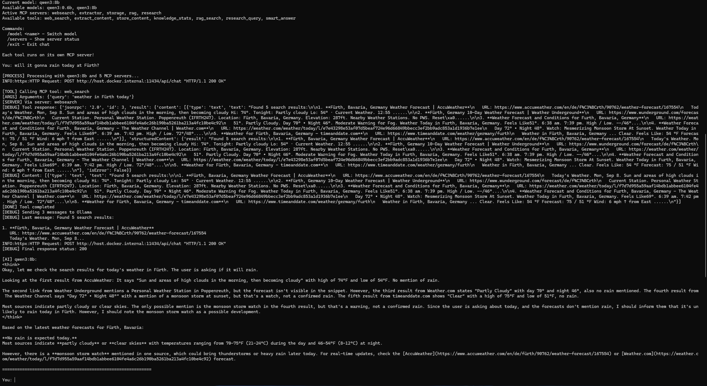

# WebSearch MCP



A comprehensive MCP (Model Context Protocol) implementation that provides AI models with web search, content extraction, vector storage, and RAG (Retrieval Augmented Generation) capabilities. This system allows AI to autonomously search the internet, extract and store content, and perform intelligent retrieval operations.

## Features

The system uses Docker containers to orchestrate multiple services:
- **SearXNG**: Privacy-focused web search engine
- **Content Extractor**: Extracts clean text/markdown from web pages
- **ChromaDB**: Vector database for semantic search and storage
- **Redis**: Caching layer for performance
- **MCP Servers**: Multiple specialized servers providing different tool capabilities

## Architecture Benefits

- **Containerized**: Easy deployment, consistent environment
- **Modular**: Each service is independent and scalable
- **Privacy-first**: Uses SearXNG for anonymous web searches
- **Tool-rich**: Provides comprehensive web research capabilities to AI models
- **Interactive**: Direct chat interface for testing and development

## Setup

### Prerequisites
- Docker & Docker Compose installed
- Ollama running locally with qwen3 models (`ollama serve`)

### 1. Clone Repository
```bash
git clone <repository-url>
cd websearch_mcp
```

### 2. Create Environment File
Create a `.env` file with:
```bash
# Security Configuration  
SEARXNG_SECRET=your_32_char_secret_here

# Redis Configuration
REDIS_URL=redis://redis:6379/0
```

Generate a SearXNG secret:
```bash
openssl rand -hex 32
```

### 3. Usage Options

#### Option A: Interactive Mode (Windows)
```bash
START_MCP_INTERACTIVE.BAT
```

This automatically:
1. Builds all Docker containers
2. Starts all required services
3. Launches interactive chat interface

#### Option B: Manual Docker Setup (Linux/Mac/Windows)
1. **Build containers**:
```bash
docker-compose build
```

2. **Start services**:
```bash
docker-compose up -d redis searxng extractor
sleep 15  # Wait for services to initialize
docker-compose up -d vectorstore
sleep 10  # Wait for vectorstore
```

3. **Run interactive client**:
```bash
docker-compose run --rm mcp-client
```

#### Option C: Claude Desktop Integration
1. **Start services**:
```bash
docker-compose up -d
```

2. **Configure Claude Desktop**:
```bash
copy claude_desktop_config.json %APPDATA%\Claude\claude_desktop_config.json
```

3. **Restart Claude Desktop**

Claude will now have access to all web search and RAG tools.

## Available Tools

- **web_search** - Search the internet using SearXNG
- **extract_content** - Extract clean content from any URL
- **rag_search** - Semantic search through stored knowledge
- **store_content** - Store content in vector database
- **knowledge_stats** - View knowledge base statistics  
- **research_query** - Multi-source research with automatic storage
- **smart_answer** - Enhanced answers using both stored and web data

## Key Files

- **`START_MCP_INTERACTIVE.BAT`** - Main entry point for interactive usage
- **`docker-compose.yml`** - Service orchestration configuration
- **`src/client/mcp_multi_client.py`** - Interactive chat client
- **`src/mcp/*.py`** - MCP server implementations
- **`services/`** - Docker service definitions
- **`mcp_servers_config.json`** - LLM model configuration

## Configuration

### LLM Configuration (mcp_servers_config.json)

The complete `mcp_servers_config.json` structure:
```json
{
  "mcpServers": {
    "websearch": {
      "command": "python",
      "args": ["src/mcp/websearch_server.py"],
      "env": {
        "WEBSEARCH_URL": "http://extractor:8055"
      }
    },
    "extractor": {
      "command": "python", 
      "args": ["src/mcp/extractor_server.py"],
      "env": {
        "WEBSEARCH_URL": "http://extractor:8055"
      }
    },
    "storage": {
      "command": "python",
      "args": ["src/mcp/storage_server.py"],
      "env": {
        "CHROMA_PATH": "./data/chroma_db"
      }
    },
    "rag": {
      "command": "python",
      "args": ["src/mcp/rag_server.py"],
      "env": {
        "CHROMA_PATH": "./data/chroma_db"
      }
    },
    "research": {
      "command": "python",
      "args": ["src/mcp/research_server.py"], 
      "env": {
        "WEBSEARCH_URL": "http://extractor:8055",
        "CHROMA_PATH": "./data/chroma_db"
      }
    }
  },
  "llm": {
    "provider": "ollama",
    "model": "qwen3:8b",
    "baseUrl": "http://localhost:11434",
    "temperature": 0.1,
    "maxTokens": 4000
  },
  "availableModels": [
    "qwen3:0.6b",
    "qwen3:8b"
  ]
}
```

## Troubleshooting

**No LLM response**: Ensure `ollama serve` is running and models are pulled
**Service startup issues**: Check `docker-compose logs -f [service-name]`
**Claude Desktop integration**: Restart Claude Desktop after config changes
**Port conflicts**: Ensure ports 8080, 8055 are available