# WebSearch MCP - Advanced Web Search & Content Extraction

A comprehensive Model Context Protocol (MCP) server that provides intelligent web search and content extraction capabilities using SearXNG, Trafilatura, and Redis caching.

## ✅ Current Status - FULLY OPERATIONAL

All core components are working:
- **✅ SearXNG Search Engine**: Multi-engine web search with 40+ search providers
- **✅ Content Extractor**: Clean text extraction from any URL with metadata
- **✅ Redis Caching**: High-performance caching for search results
- **✅ Docker Deployment**: One-command setup with docker-compose
- **✅ Corrected Result Counts**: Fixed `number_of_results` to show actual count

## 🚀 Features

### Core Search & Extraction (✅ Implemented)
- **Multi-Engine Search**: Powered by SearXNG with multiple search engines (Google, DuckDuckGo, Brave, StartPage, Wikipedia, etc.)
- **Intelligent Content Extraction**: Uses Trafilatura with BeautifulSoup fallback
- **Smart Caching**: Redis-based caching for search results and extracted content  
- **Clean Text Output**: Removes ads, navigation, and clutter - returns only content
- **Metadata Extraction**: Title, author, date, description, tags, language detection
- **Flexible API**: RESTful HTTP endpoints for easy integration

### Chat Interface Features

1. **Smart Natural Language**
   - "Tell me about recent FAPS projects" → Auto search + extract
   - "What are the latest AI developments?" → Comprehensive research
   - "Get content from https://example.com" → Auto extraction

2. **Manual Commands**
   - `/search <query>` - Search the web
   - `/extract <url>` - Extract content from URL
   - `/health` - Check service status

3. **Available APIs**
   - **`/search`** - Multi-engine web search with result counts
   - **`/extract`** - Clean text extraction with metadata
   - **`/health`** - Service monitoring and diagnostics

## 🏗 Architecture

```mermaid
flowchart LR
    Client["🤖 MCP Client<br/>(Model)"]
    Server["⚡ MCP Server<br/>(FastAPI)"]
    SearXNG["🔍 SearXNG API<br/>(Multi-Engine)"]
    Engines["🌐 Search<br/>Engines"]
    Extractor["📄 Extractor<br/>Service"]
    Tools["🛠️ Trafilatura<br/>+ BS4"]
    Cache["💾 Redis<br/>Cache"]
    
    Client --> Server
    Server --> SearXNG
    SearXNG --> Engines
    Server --> Extractor
    Extractor --> Tools
    Extractor --> Cache
    
    classDef client fill:#e1f5fe,stroke:#01579b,stroke-width:2px
    classDef server fill:#f3e5f5,stroke:#4a148c,stroke-width:2px
    classDef search fill:#e8f5e8,stroke:#1b5e20,stroke-width:2px
    classDef process fill:#fff3e0,stroke:#e65100,stroke-width:2px
    classDef storage fill:#fce4ec,stroke:#880e4f,stroke-width:2px
    
    class Client client
    class Server,SearXNG server
    class Engines search
    class Extractor,Tools process
    class Cache storage
```


## 🐳 Quick Start with Docker

### Prerequisites
- Docker and Docker Compose
- 2GB+ available RAM
- Ports 8055, 8080 available

### 1. One-Command Setup
```bash
git clone https://github.com/GhoshSrinjoy/Web_search_mcp.git
cd Web_search_mcp

# Build and start all services
docker-compose up -d --build

# Wait for services to start (about 30 seconds)
```

### 2. Start Smart Chat Interface
```bash
# Quick start with gpt-oss:20b
START_WEBSEARCH.BAT

# Or with model selection
QUICKSTART.BAT

# Or manually start chat interface
python smart_ollama_chat.py gpt-oss:20b
```

### 3. Verify All Services
```bash
# Check service status
docker-compose ps

# Test search API
curl -X POST http://localhost:8055/search \
  -H "Content-Type: application/json" \
  -d '{"query": "python programming", "max_results": 3}'

# Test content extraction
curl -X POST http://localhost:8055/extract \
  -H "Content-Type: application/json" \
  -d '{"url": "https://example.com"}'

# Check service health
curl http://localhost:8055/health
```

### 4. Connect MCP Client

The MCP server runs on stdio protocol (standard for MCP):
```json
{
  "mcpServers": {
    "websearch": {
      "command": "docker",
      "args": ["exec", "websearch_mcp-mcp-1", "python", "server.py"]
    }
  }
}
```

For direct HTTP testing, use the extractor service endpoints at `http://localhost:8055`

## 🛠 Configuration

### 🔐 Security Setup (Important!)

**Generate a new SearXNG secret key before deployment:**

```bash
# Generate a secure secret key
openssl rand -hex 32

# Or in Python
python -c "import secrets; print(secrets.token_hex(32))"

# Or online
# https://www.allkeysgenerator.com/Random/Security-Encryption-Key-Generator.aspx
```

**Update the secret key in `config/searxng/settings.yml`:**
```yaml
server:
  secret_key: "YOUR_GENERATED_SECRET_KEY_HERE"  # Replace this!
```

### Environment Variables

#### MCP Server (`services/mcp/`)
```bash
PORT=8001                          # Server port
SEARXNG_URL=http://searxng:8080   # SearXNG instance
EXTRACTOR_URL=http://extractor:8055 # Content extractor
REDIS_URL=redis://redis:6379       # Redis cache
MAX_CONCURRENT_REQUESTS=5          # Batch fetch limit
RATE_LIMIT_PER_DOMAIN=2           # Requests per second per domain
CACHE_TTL=3600                    # Cache duration (seconds)
```

#### Content Extractor (`services/extractor/`)
```bash
PORT=8055                         # Extractor port
REDIS_URL=redis://redis:6379      # Redis cache
MAX_CONTENT_LENGTH=10485760       # Max content size (10MB)
REQUEST_TIMEOUT=30                # Request timeout (seconds)
```

### SearXNG Configuration

Edit `config/searxng/settings.yml` to:
- Enable/disable search engines
- Configure rate limiting  
- Set default search preferences
- Configure privacy settings

## 📊 Usage Examples

### Basic Web Search
```python
# Search for recent AI news
results = await web_search(
    query="artificial intelligence breakthroughs",
    max_results=10,
    time_range="week",
    language="en"
)

print(f"Found {results.count} results")
for result in results.results:
    print(f"- {result.title}: {result.url}")
```

### Content Extraction
```python
# Extract content from a URL
content = await fetch_content(
    url="https://example.com/article",
    extract_images=True,
    timeout=30
)

print(f"Title: {content.title}")
print(f"Content: {content.text[:500]}...")
print(f"Images: {len(content.images)}")
```

### Batch Operations
```python
# Process multiple URLs concurrently
urls = [
    "https://example1.com",
    "https://example2.com", 
    "https://example3.com"
]

contents = await batch_fetch(
    urls=urls,
    max_concurrent=3,
    use_javascript=False
)

for content in contents:
    print(f"{content.title}: {len(content.text)} chars")
```

### Advanced Search with Filters
```python
# Academic paper search
results = await web_search(
    query="machine learning transformers",
    categories="science",
    time_range="month", 
    safe_search=0,
    max_results=20
)

# Extract content from top papers
papers = await batch_fetch([r.url for r in results.results[:5]])
```

## 🔧 Management Commands

```bash
# Deployment
./deploy.sh                    # Initial deployment
./deploy.sh restart           # Restart all services  
./deploy.sh stop              # Stop all services

# Monitoring  
./deploy.sh logs              # View service logs
./deploy.sh status            # Check service status
./deploy.sh test              # Run functionality tests

# Manual operations
docker-compose up -d          # Start services
docker-compose down           # Stop services
docker-compose logs -f mcp    # Follow MCP server logs
```

## 📈 Performance & Scaling

### Caching Strategy
- **Search Results**: 1 hour TTL, keyed by query+filters
- **Page Content**: 1 hour TTL, keyed by URL hash
- **Redis Memory**: Configure `maxmemory` and eviction policy

### Rate Limiting
- **Per Domain**: 2 requests/second (configurable)
- **Global Concurrency**: 5 concurrent requests (configurable)  
- **Request Timeout**: 30 seconds (configurable)

### Resource Usage
- **Memory**: ~2-4GB for full stack
- **CPU**: Scales with concurrent requests
- **Storage**: Redis persistence + container images

## 🔍 Monitoring & Debugging

### Health Checks
```bash
# Check all services
curl http://localhost:8001/health  # MCP server
curl http://localhost:8055/health  # Content extractor
curl http://localhost:8080/healthz # SearXNG

# Redis status
docker-compose exec redis redis-cli info stats
```

### Logging
```bash
# Service logs
docker-compose logs -f mcp        # MCP server logs
docker-compose logs -f extractor  # Extractor logs
docker-compose logs -f searxng    # SearXNG logs

# Redis monitoring
docker-compose exec redis redis-cli monitor
```

### Cache Management
```python
# Check cache stats
session_info = await get_session_info()
print(f"Searches: {session_info.searches_performed}")
print(f"Extractions: {session_info.pages_extracted}")

# Clear cache
await clear_cache("search:*")  # Clear search cache
await clear_cache("content:*") # Clear content cache  
await clear_cache()            # Clear all cache
```

## 🚦 Troubleshooting

### Common Issues

#### 1. Services Not Starting
```bash
# Check Docker resources
docker system df
docker system prune  # Free up space

# Restart specific service
docker-compose restart mcp
```

#### 2. Search Not Working
```bash
# Check SearXNG engines
curl http://localhost:8080/search?q=test&format=json

# Verify MCP can reach SearXNG
docker-compose exec mcp curl http://searxng:8080/healthz
```

#### 3. Content Extraction Failing
```bash
# Test extractor directly
curl -X POST http://localhost:8055/extract \
  -H "Content-Type: application/json" \
  -d '{"url": "https://example.com"}'

# Check extractor logs
docker-compose logs -f extractor
```

#### 4. High Memory Usage
```bash
# Check Redis memory
docker-compose exec redis redis-cli info memory

# Configure Redis maxmemory
docker-compose exec redis redis-cli config set maxmemory 1gb
docker-compose exec redis redis-cli config set maxmemory-policy allkeys-lru
```

### Performance Tuning

1. **Increase concurrency** for batch operations
2. **Adjust cache TTL** based on content freshness needs
3. **Configure Redis eviction** policy for memory management
4. **Use SSD storage** for better Redis performance
5. **Monitor rate limits** and adjust per domain

## 🤖 Smart Chat Interface

### New: Intelligent Tool Usage
- **Natural Language**: "Tell me about recent FAPS projects"
- **Auto Tool Chaining**: Automatically searches + extracts content like Claude/GPT
- **Smart Intent Detection**: Understands what you want without explicit commands
- **Multiple Interface Options**: Simple commands or natural conversation

### Usage Options
1. **Smart Interface** (`smart_ollama_chat.py`): Natural language with auto tool chaining
2. **Simple Interface** (`simple_ollama_chat.py`): Manual commands only
3. **MCP Integration**: Full Claude Desktop / other MCP client support

## 📄 License

Apache License, Version 2.0 - see LICENSE file for details.

## 🤝 Contributing

1. Fork the repository
2. Create feature branch
3. Test changes thoroughly  
4. Submit pull request

## 🆘 Support

- **Issues**: Create GitHub issue with logs and configuration
- **Discussions**: Use GitHub discussions for questions
- **Documentation**: Check this README and inline code comments
